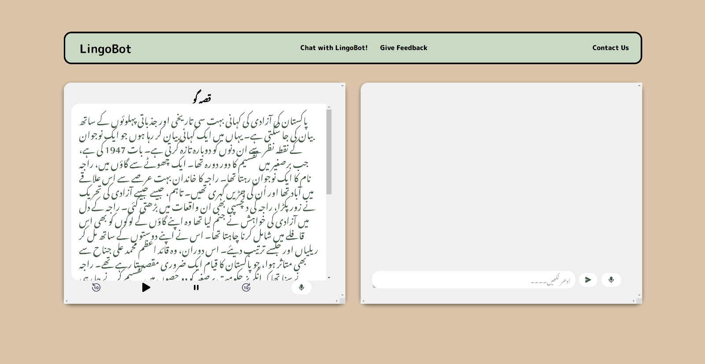
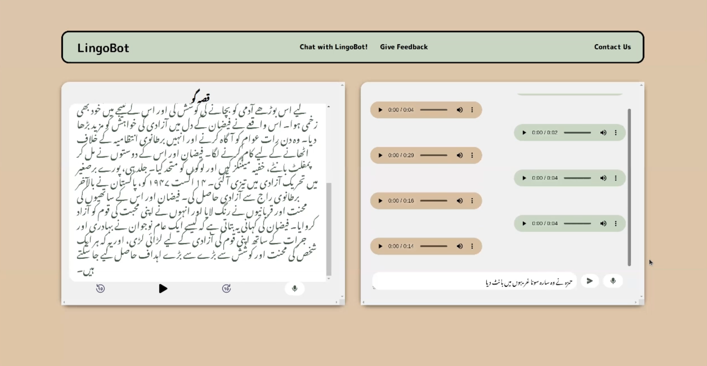

# LingoBot: The Urdu Language Learning Platform

## Overview

LingoBot is a dynamic language learning platform, initially designed to aid in learning Urdu, a language considered underrepresented in technology. Our platform leverages generative AI to provide an interactive and engaging learning experience, and it can easily be adapted to other languages as well.

## Features

### Urdu Voice Storyteller
- **Voice Interaction:** Users can interact with the system by speaking into a microphone. The platform uses an Urdu Automatic Speech Recognition (ASR) system to convert spoken prompts into text.
- **Story Generation:** Text prompts are processed by the GPT-4 Turbo model to generate stories tailored to user preferences.
- **Playback Controls:** Stories can be played, paused, and navigated through (fast forward or rewind). 
- **Text Display:** Alongside auditory output, stories are displayed in a beautiful Urdu font.



### Voice Chatbot
LingoBot also includes a versatile voice chatbot with the following functionalities:
1. **General Conversational AI:** Engage in day-to-day conversations in Urdu.
2. **Adventure Story Game:** Activate this mode by saying "آؤ کہانی سفر کھیلیں" (Let's play a story adventure).
3. **Urdu Grammar Teacher:** Learn and practice Urdu grammar interactively. Activate this by saying "اُردو پڑھتے ہیں" (Let's study Urdu).



## Built With

- [](https://reactjs.org/)
- [](https://pytorch.org/)
- [
- [](https://firebase.google.com/)
- [](https://openai.com/)

## Getting Started

### Prerequisites
Ensure you have `node.js` and `npm` installed on your system to run the front-end part of LingoBot. For the backend, Python and pip are required.

### Running the Frontend
1. Navigate to the frontend directory.
2. Install dependencies:
   ```sh
   npm install
   ```

### Setting Up the Backend

Follow these steps to set up and run the backend server for LingoBot:

1. **Navigate to the server folder:**
   Change into the server directory where the backend code resides.

2. **Install the necessary Python libraries:**
   Run the following command to install dependencies listed in `requirements.txt`:
   ```sh
   pip install -r requirements.txt
   ```
3. **Add Your Key:**
   Get your openai key and add it in the `server.py` file.
   
4. **Run the server:**
   Start the server using uvicorn with the command below:
   ```sh
   uvicorn server:app --reload
   ```
